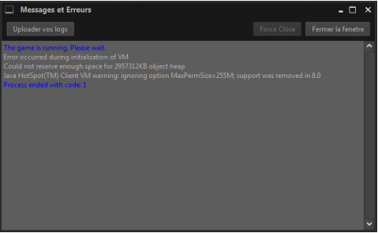

Que faire si j’ai une erreur comme ça ?

+++++++++++++++++++++++++++++++++++++++++

Tout d’abord regarder votre version de java, pour ça :

1. Lancez le menu Démarrer de Windows.

2. Cliquez sur Programmes.

3. Puis sur Programmes et fonctionnalités.

4. Et enfin, cherché Java.

   
Si jamais l’architecture « 64-bit » est spécifié, exemple comme ça
Alors vous avez la version 64 bit de java.
Mais si jamais l’architecture n’est pas spécifié exemple : « Java 8 Update 131 »
Alors vous êtes avec l’architecture 32bit de java.
Dans ce cas-là, si la version de votre Windows à l’architecture x64 alors
télécharger la version 64 bit sur le site de java.
« Windows Hors ligne (64 bits) »
Sur Le `Site de Java <https://www.java.com/fr/download/manual.jsp/>`_
