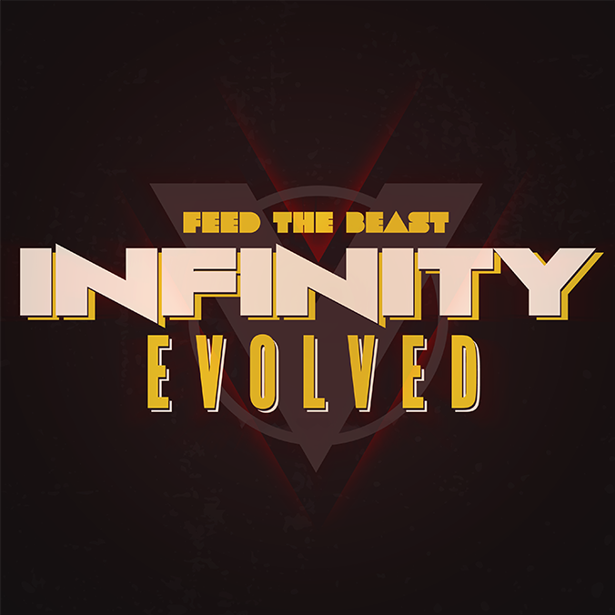
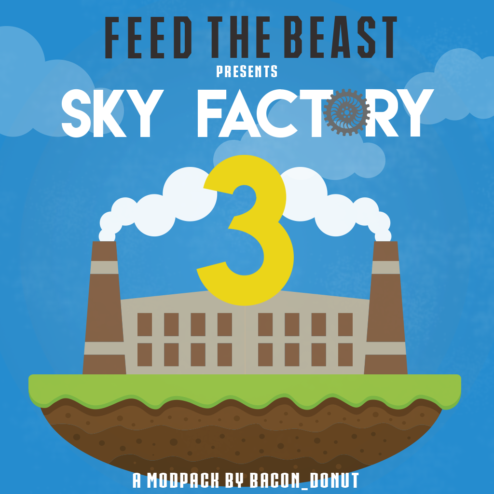

Nos Serveurs
++++++++++++

.. note::
   Utilisez ``ctrl`` + ``F`` pour rechercher le modpack directement.
   
.. contents::
   :depth: 2
   :local:
   
FTB Ultimate
----------------------------------------------------------
.. image:: FTB-Ultimate.png
    :width: 200px
    :align: center
    :height: 100px

Thème du modpack: 
   Vivre une aventure survie avec un modpack qui en as pour tous les gouts que ce soit magie, technologie, exploration.
   
Genre:
   Survie

Version:
   1.4.7
   
Adresse:
   ultimate.mineaurion.com
   
La difficulté:
   Facile

Où le trouvé ?:
   Sur Le `FTB Launcher <http://legacy.feed-the-beast.com/>`_
   
Mods:

* Applied Energistics

* BiblioCraft

* BuildCraft

* Forestry

*  Extra Bees

* Thermal Expansion

* ChickenChunks

* CoFH Core

* ComputerCraft

* Misc Peripherals

* Equivalent Exchange 3

* EnderStorage

* ExtrabiomesXL

* Factorization

* Flat Bedrock

* Forge IRC

* Gravity Gun

* ImmibisCore

* IndustrialCraft2

*  Advanced Machines

*  Advanced Solar Panels

*  Charge Pads

*  Gravitation Suite

* GregTech

* Modular Force Field System

* Nuclear Control

* Petroleum Generator

* IntegratedSoundpacks

* Inventory Tweaks

* Iron Chests

* MineFactory Reloaded

* Modular Powersuits

* Mystcraft

* Nether Ores

* Not Enough Items

* NEI Plugins

* Obsidian Pressure Plates

* OmniTools

* Portal Gun

* Power Converters

* PowerCrystals Core

* Railcraft

* RedPower 2

* Secret Rooms

* Soul Shards

* Steve's Carts 2

* Thaumcraft 3

* Magic Bees

* TubeStuff

* Twilight Forest

* VoxelMap

*  VoxelMenu

*  VoxelPlayer

* Wireless Redstone Chicken Bones Edition

* Xeno's Reliquary

*  XyCraft

FTB Infinity
---------------------------------

Thème du modpack: 
   Vivre une aventure survie avec un modpack qui lui aussi en as pour tous les gouts ainsi qu'un large éventail de mods présent sur le       modpack
   
Genre:
   Survie

Version:
   1.7.10
   
Adresse:
   infinity.mineaurion.com
   
La difficulté:
   Moyen

Où le trouvé ?:
   Sur Le `Launcher de Mineaurion <https://mineaurion.com/>`_
   
Mods:

* Advanced Solar Panels	   

* AgriCraft	               

* AOBD 2	                  

* Applied Energistics 2	   

* Avaritia	                  

* Baubles	                  

* BDLib	                     

* BiblioCraft	               

* BiblioWoods BoP	         

* BiblioWoods Forestry	      

* BiblioWoods Natura	     

* Big Reactors	            

* Binnie's Mods	           

* Biomes O' Plenty	         

* Blood Magic	            

* Botania	               

* Brandon's Core	        

* bspkrsCore	              

* BuildCraft	             

* Buildcraft Compat	    

* Carpenter's Blocks	     

* ChickenChunks	          

* Chisel 2	              

* CodeChickenCore	       

* CoFH Core	               

* CoFH Lib	                

* ComputerCraft	          

* Custom Main Menu	       

* Decocraft	              

* Dense Ores	          

* Draconic Evolution	      

* EnderCore	            

* EnderIO	                  

* EnderStorage	        

* EnderTech	            

* Ender Zoo	         

* Extra Cells 2	           

* ExtraTiC	                 

* Extra Utilities	       

* Fastcraft	            

* FastLeafDecay	          

* Forbidden Magic	       

* Forestry	                  

* FTBLib	               

* FTBTweaks	            

* FTB Utilities	            

* Funky Locomotion	     

* Gendustry	            

* Gravitation Suite	         

* GuideAPI	                  

* Hats	                 

* Hat Stand	            

* Headcrumbs	           

* Nuclear Control	       

* iChunUtil	            

* Immersive Engineering	

* Immersive Integration	   

* Immibis Core	          

* IndustrialCraft 2	       

* INpureCore	               

* Inventory Tweaks	         

* Iron Chests	               

* JABBA	                    

* JourneyMap	            

* Logistics Pipes	       

* Magic Bees            	 

* Mantle	               

* McJtyLib	              

* MineFactory Reloaded	      

* MineTweaker 3	            

* ModTweaker 2	         

* Morpheus	                  

* Mystcraft	               

* Natura	                  

* NEI Addons	               

* NEI Integration	      

* Nether Ores	             

* Not Enough Items	         

* Not Enough Resources	      

* Nuclear Control 2	       

* OpenBlocks	               

* OpenModsLib	              

* OpenPeripheral Addons	   

* OpenPeripheral Core	      

* OpenPeripheral Integration

* Pam's HarvestCraft	     

* Portal Gun	               

* Project Red	              

* Railcraft	           

* Redstone Arsenal	       

* Resource Loader	       

* RFTools	                

* Runic Dungeons	         

* Simply Jetpacks	       

* Solar Expansion	         

* Springboards	            

* Steve's Addons	            

* Steve's Carts 2	         

* Steve's Factory Manager	   

* Steve's Workshop	       

* Storage Drawers	         

* Thaumcraft 4	            

* Thaumcraft NEI Plugin	   

* Thaumic Energistics	    

* Thaumic Exploration	    

* Thaumic Tinkerer 2	     

* Thermal Dynamics	       

* Thermal Expansion 4	    

* Thermal Foundation	      

* TiC Tooltips	         

* Tinker's Construct	      

* Tinker's Mechworks	    

* Translocators	            

* ttCore	                

* Twilight Forest	         

* Waila	                     

* Waila Harvestability	     

* Wawla	                    

* Witchery	                 

* WR-CBE	                

FTB Beyond
-----------------------------------------------------------

    
Thème du modpack: 
   Vivre une aventure survie avec un modpack qui vous donne un peu de fil à retordre ce modpack est fait pour vous alors.
   
Genre:
   Survie

Version:
   1.10.2
   
Adresse:
   beyond.mineaurion.com
   
La difficulté:
   Difficile

Où le trouvé ?:
   Sur Le `Launcher de Mineaurion <https://mineaurion.com/>`_

Mods:

* Actually Additions	
* Advanced Machines		
* Advanced Solar Panels		
* AE Stuff		
* AgriCraft	
* AnimationAPI		
* AppleSkin		
* Applied Energistics 	
* Applied Energistics  Core	
* Aquaculture		
* ArchitectureCraft		
* Aroma's Dimensional World		
* AromaCore	
* AromaCore|Helper		
* Ars Magica 		
* AutoRegLib		
* Baubles		
* BD Lib		
* Better Builder's Wands		
* BetterBedrockGen		
* BetterThanBunnies		
* BiblioCraft		
* Blood Arsenal		
* Blood Magic: Alchemical Wizardry		
* Bookshelf		
* Botania	
* Brandon's Core		
* cclentityhook		
* Ceramics
* Chameleon		
* Chest Transporter		
* Chisel	MC	
* Chisels & Bits		
* Clipboard	
* CodeChicken Core		
* CodeChicken Lib		
* CoFH ASM		
* CoFH Core		
* Compact Solar Arrays		
* Controlling		
* Cooking for Blockheads	
* CraftTweaker JEI Support
* CTUI		
* Custom Main Menu	
* Dark Utilities		
* Decocraft		
* DeepResonance		
* Default Options		
* Draconic Evolution	
* Drawers & Bits		
* ElecCore		
* Elevator Mod		
* Embers		
* Ender IO		
* EnderCore	
* EnderStorage		
* Engineers Workshop	
* Environmental Tech	
* ET Lunar	
* Extra Utilities 	
* Extreme Reactors	
* Flat Colored Blocks
* FluxNetworks		
* FoamFix		
* FoamFixCore		
* Forestry		
* Forge Microblocks	
* Forge Mod Loader	
* Forge Multipart CBE
* Forgelin		
* FTB Tweaks		
* FTBLib		
* FTBUtilities		
* Funky Locomotion	
* Funnels		
* GenDustry		
* Gravestone		
* Gravitation Suite	
* GuideAPI	
* Hammer Core		
* HelpFixer		
* Hopper Ducts		
* Immersive Engineering
* IndustrialCraft 	
* InfinityLib		
* InGame Info XML		
* Interaction Wheel		
* Inventory Tweaks		
* Iron Backpacks		
* Iron Chest		
* JEI Bees		
* JourneyMap		
* Just Enough Calculation		
* Just Enough Items		
* Just Enough Resources		
* KleeSlabs		
* LaunchGUI	
* Long Fall Boots		
* LunatriusCore		
* Mantle		
* MCMultiPart		
* Mercurius		
* Minecraft Coder Pack	
* Minecraft Forge		
* Minecraft Multipart Plugin		
* MineTweaker 		
* MmmMmmMmmMmm		
* mob_grinding_utils		
* Mod Name Tooltip		
* Mod Tweaker		
* ModLister		
* ModPack Basic Tools		
* ModPack Utilities		
* Modular ForceField System		
* More Bees		
* MorphoTool		
* Morpheus		
* Mouse Tweaks		
* MrTJPCore		
* MTLib	@VERSION@	
* MultiStorage		
* Natura						
* Nether Portal Fix			
* Not Enough Items			
* OpenComputers				
* OpenComputers (Core)		
* pwrd's Library				
* Pam's HarvestCraft			
* ProjectRed Core				
* ProjectRed Expansion		
* ProjectRed Exploration		
* ProjectRed Illumination		
* ProjectRed integration		
* ProjectRed Transmission		
* projectredtansportation		
* Psi
* PTRModelLib		
* QuantumStorage		
* Quark	
* Railcraft		
* Ranged Pumps		
* ReAuth
* RebornCore		
* reborncoreMCMultiPart		
* Refined Relocation	
* Refined Storage
* Reliquary		
* Resource Loader		
* RFTools		
* RFTools Control		
* Roots		
* ShadowMC		
* ShetiPhianCore		
* Signals		
* Simple Retrogen	
* SimpleVoidWorld		
* Simply Jetpacks 		
* Sleeping Bag		
* Snad	
* Solar Flux Reborn	
* SonarCore		
* Steve's Carts 		
* Storage Drawers		
* Storage Drawers Extras		
* Super Circuit Maker		
* Super Crafting Frame		
* TechReborn		
* The One Probe		
* Thermal Expansion		
* Thermal Foundation		
* Tinkers Tool Leveling	
* Tinkers' Construct		
* TOP Addons	
* TorchMaster		
* Translocator		
* UniDict	
* Useful Nullifiers		
* Valkyrie Lib		
* WanionLib		
* Wireless Crafting Grid		
* Wireless Crafting Terminal
* WirelessRedsoneCBE		
* Woot		
* YABBA		
* Zero CORE

Sky Factory
-----------------------------------------------------------

    
Thème du modpack: 
   Vivre une aventure survie sur une ile et devoir cherché à se développer seul alors je vous suggère ce modpack.
   
Genre:
   Survie

Version:
   1.10.2
   
Adresse:
   skyfactory.mineaurion.com
   
La difficulté:
   Moyen

Où le trouvé ?:
   Sur Le `Launcher de Mineaurion <https://mineaurion.com/>`_
   
Mods:

* FenceOverhaul
* ActuallyAdditions
* actuallycomputers
* angelRingToBauble
* AppleCoremc
* AppleShields
* AppleSkinmc
* autopackager
* AutoRegLib
* baconators
* base
* Baubles
* bdlib
* BedBugs
* BetterBuildersWands+ffe
* BetterFps
* BetterThanBunnies
* BiomeTweaker
* BlockDispenser
* BloodMagic
* Bookshelf
* Botania
* BrandonsCoreuniversal
* Ceramics
* Chameleon
* ChanceCubes
* Charset
* ChestTransporter
* ChickenChunksuniversal
* chickens
* ChiselMC
* chiselsandbits
* ClientTweaks
* Clipboard
* Clumps
* CodeChickenCoreuniversal
* CodeChickenLibuniversal
* ColossalChests
* CommonCapabilities
* compatlayer
* Controlling
* CookingForBlockheads
* CraftTweake
* CustomMainMenuMC
* CyclopsCore
* DarkUtilities
* Decocraft
* DefaultOptions
* dimensionalcake
* DraconicEvolutionuniversal
* DragonMounts
* DrawersBits
* ElevatorMod
* EnderCorebeta
* EnderIO
* EnderStorageuniversal
* EngineersWorkshop
* environmentaltechb
* etlunara
* ExCompressum
* exnihiloadscensio
* ExtraBitManipulation
* extrautils
* ExtremeReactors
* fairylights
* flatcoloredblocks
* FluxNetworks
* foamfixanarchy
* Forgelin
* FTBLibx
* FTBUtilitiesx
* FullscreenWindowed
* Funnels
* GardenOfGlass
* generatorsmc
* GooglyEyes
* GraveStone
* Grue
* GuideAPI
* Gyth
* HammerCore
* hatchery
* Headcrumbs
* hopperductsmc
* HwylaB
* hydrogel
* ImmersiveEngineering
* InGameInfoXMLuniversal
* InitialInventory
* IntegratedDynamics
* IntegratedTunnels
* inventorysorter+
* IronBackpacks
* ironchest
* ItsBecauseUHasNoGoodSpawn
* itsrainingfood
* jei
* journeymap
* KleeSlabs
* literalascension
* llibrary
* LongFallBoots
* LootBags
* LunatriusCoreuniversal
* Mantle
* mcjtylibx
* MCMultiPartuniversal
* Mercurius
* MineMenuuniversal
* minicoal
* missingpieces
* MoarSigns
* MobGrindingUtils
* ModTweaker
* MoreChickens
* MoreShearables
* moreshearsrelease
* Morpheus
* MouseTweaksmc
* mpbasic
* mputils
* MTLib
* mysticalagriculture
* natura
* Neat
* nice
* NotEnoughItemsuniversal
* notenoughwandsx
* OpenComputersMC
* OptiFineHDUD
* OreExcavation
* PackingTape
* Pam's HarvestCraft
* platforms
* Psi
* QuantumStorage
* RandomThingsMC
* rangedpumps
* RebornCoreuniversal
* RebornStorage
* redstonepastemc
* refinedstorage
* Reliquia
* ResourceLoaderMC
* rftoolsx
* rftoolsctrlx
* rftoolsdimx
* roots
* SBMWoodenShearsbuniversal
* scanner
* ShadowMC
* shearmadness
* shetiphiancore
* SimpleAchievementsMC
* simplebarrelse
* SimpleCorn
* simplegeneratorsa
* simplelabels
* SimplyJetpacks
* Snada
* SolarFluxRebornr
* SonarCore
* StevesCarts
* StorageDrawers
* SuperCircuitMake
* Surge
* TConstruct
* The Beneath
* TinkerToolLeveling
* tinyprogressions
* torchmaster
* Translocatorsuniversal
* TSK
* Twitchcrumbs
* UniDict
* valkyrielib
* voidcup
* Waddles
* WanionLib
* Wawla
* witherCrumbs
* xprings
* YUNoMakeGoodMap
* zerocore

AuriaPack
-----------------------------------------------------------

Starbound
-------------------------------------------------------------

